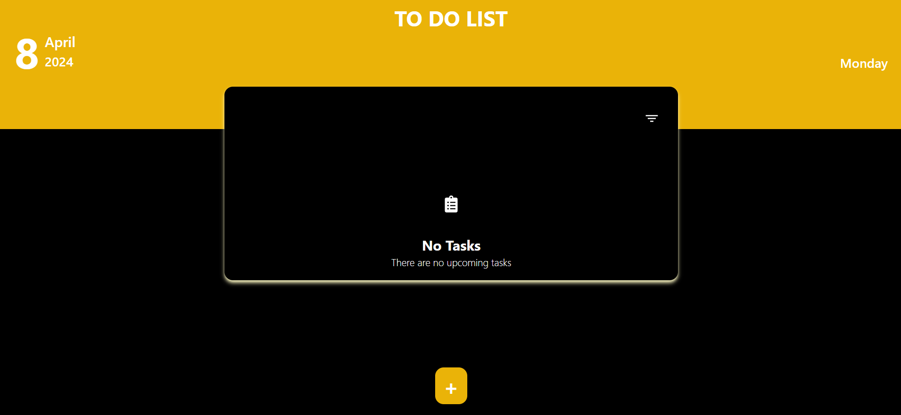
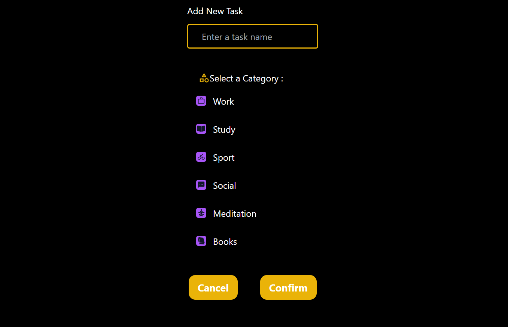
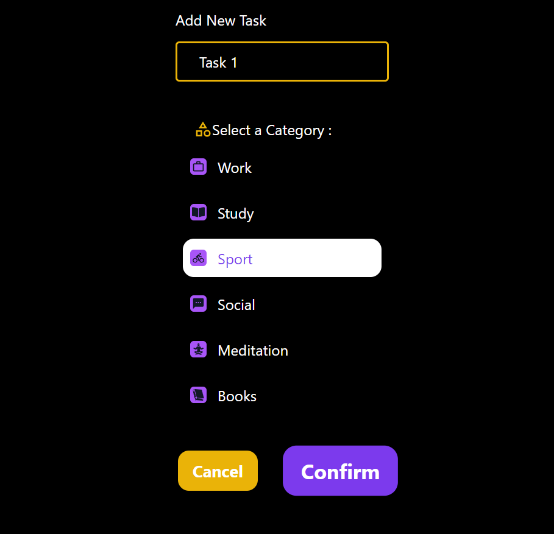
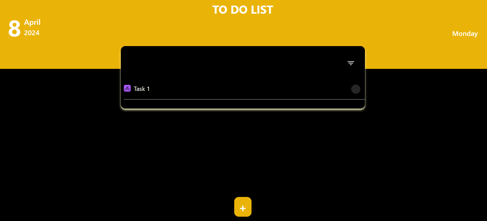
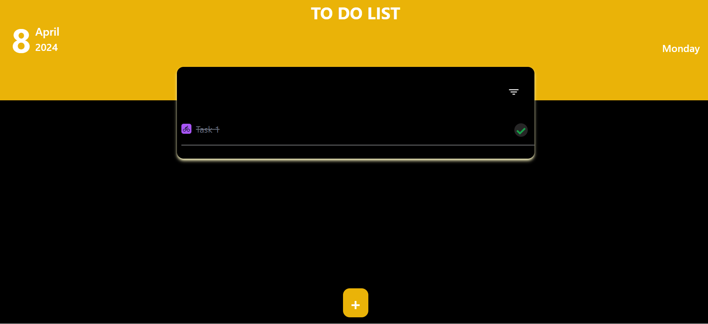
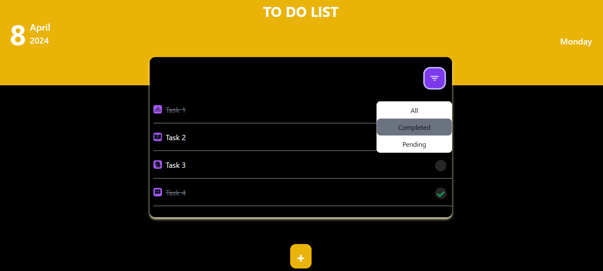

# **ToDoList App**

The ToDoList app is a simple task management application that allows users to add tasks, mark them as completed or incomplete, assign categories to tasks, and filter their task list based on task status. Tasks are displayed with icons representing their categories.

## **Features**

- **Add tasks:** Users can add tasks to their ToDoList and assign them categories.
- **Toggle task status:** Clicking on a task toggles its status between completed and incomplete.
- **Category selection:** Users can choose a category for their task from multiple available options.
- **Filter tasks:** Users can filter their task list based on task status (completed or pending).

## **Usage**

1. Launch the app by opening the provided URL in your web browser.
2. Click on the "+" button to add a new task.
3. Type the task description in the input field, and select the desired category from the categories choices  bellow it .
4. Click "Add Task".
5. To mark a task as completed, click on the task item.

## **Contributing**

If you'd like to contribute to the ToDoList app, please follow these guidelines:

1. Fork the repository: Click the "Fork" button at the top-right corner of the repository page to create your own copy of this repository.
2. Create a new branch for your feature or bug fix: Before making any changes, create a new branch where you'll work on your contribution. This helps keep the main branch clean and makes it easier to manage changes:
    git checkout -b feature-or-bug-fix (Replace feature-or-bug-fix with a descriptive name for your branch)
3. Make your changes and commit them with descriptive messages:
    git add .
    git commit -m "Add your descriptive message here"

4. Push your changes to your fork:
    git push origin feature-or-bug-fix

5. Submit a pull request to the main repository:
Once your changes are pushed to your fork, it's time to submit a pull request to the main repository. This notifies the project maintainers that you have changes you'd like to contribute. Navigate to the main repository's page on GitHub, then click on the "Pull requests" tab and select "New pull request". Choose your fork and branch, add a descriptive title and message explaining your changes, and submit the pull request.
# Screenshots

Here are the screenshots of the ToDoList App:

## **License**

This project is licensed under the MIT License. See the LICENSE file for details.

## **Credits**

The ToDoList app was created by Jihad ELFOUGHI.

## **Contact Information**

If you have any questions or suggestions, feel free to reach out to me at ji.elfoughi@gmail.com.
